# 引言：文档代码化

**文档代码化** **([*Docs as Code*](http://www.writethedocs.org/guide/docs-as-code/))**，是一种新兴的的技术文档开发模式，特指使用代码开发的方式和工具进行文档开发。

文档代码化意味文档开发人员需遵从与产品开发团队相同的工作流程，使用代码开发的方式和工具开发文档，可有效节省工具成本，提升文档开发效率，并增强产品研发和文档写作的协同管理。

目前，微软、亚马逊和阿里等高科技公司已逐渐将文档代码化应用于生产实践，其文档开发流程大致包括五大步骤：

1. 使用 Markdown、reStructuredText 等标记语言写作；
2. 通过 Git 进行版本管理和协同写作；
3. 使用代码开发集成环境作为写作工具；
4. 通过文档发布工具将 Markdown、reStructuredText 文件发布为网页或PDF等格式；
5. 收集文档的用户使用数据，不断迭代改进文档质量。

本教程主要借助 Sphinx 这一轻量级文档开发工具向同学们介绍了文档代码化开发的完整流程，主要包括两大部分：

+ **快速入门：** Sphinx 开发环境配置、Sphinx 基本操作以及 reStructuredText 语法指南；
+ **专题学习：**在前者的基础上引入了更多进阶操作，以专题的形式呈现，主要包括文档的本地发布、云端托管、文档主题定制、多人协作开发等。

---

# （一）快速入门

- [Sphinx](http://www.sphinx-doc.org/) 是一种基于 Python 的文档工具，它可以令人轻松的撰写出清晰且优美的文档，由 Georg Brandl 在 BSD 许可证下开发。
- Sphinx 最初是为创作[新版的 Python 文档](http://docs.python.org/)而开发的，如今它已成为Python 项目首选的文档工具，并对其它开发语言也有很好的支持。

- Sphinx 采用 [reStructuredText](https://docutils.sourceforge.io/rst.html) 作为默认标记语言，并使用 [Docutils](http://docutils.sf.net/) 对标记文本进行解析和转换。

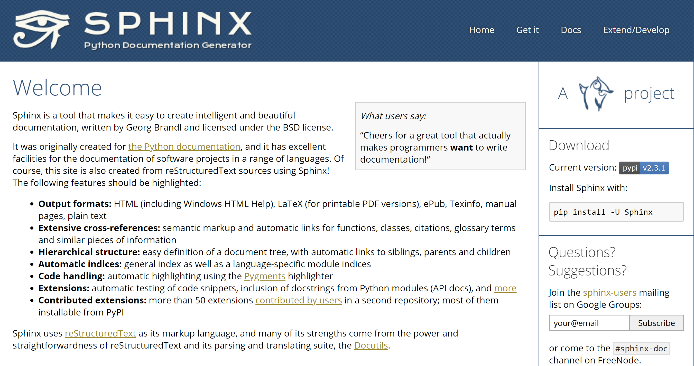

## 1 Sphinx 开发环境配置

参考 Sphinx 的官方文档，[配置 Sphinx 开发环境](http://www.sphinx-doc.org/en/master/usage/installation.html) 主要包括安装 Python 开发环境、使用 pip 工具安装 sphinx 、安装配置文本、代码编辑器等步骤，同时还涉及到使用命令行和修改系统环境变量等操作。这些步骤对于初学者来说略有些复杂繁琐，很容易就迷失在各种琐碎的配置细节中，打击同学们的学习热情。

不过 Python 社区始终有一批能人志士在为简化和优化开发环境配置而作各种努力，Anaconda 就是其中相当出色一个，下面将会介绍如何通过 Anaconda 和 VS Code 在 Windows 和 macOS 两大操作系统上配置 Sphinx 开发环境，同学们可以根据自己使用的操作系统查看相应的部分。

> + **Anaconda** 是一个开源的 Python 发行版，支持 Windows、macOS、Linux，Anaconda 是一个打包的集合，里面预装好了conda、Python 解释器、众多第三方库（比如 Sphinx）、科学计算工具等等，其核心功能是由 conda 提供的包管理与环境管理功能。
>
> + **Visual Studio Code (VS Code)** 是由 Microsoft 公司开发的新一代代码编辑器，支持 Windows、macOS、Linux，将代码编辑器、调试器、命令行/终端等工具巧妙整合与一体，具有语法高亮、代码补全、括号匹配等功能，支持版本管理和远程开发，还拥有丰富的拓展生态。

---

### 1.1 Windows 环境配置

> **注意：**以下步骤不需要同学们预先安装 Python 解释器，而是直接使用 Anaconda 内集成的 Python 解释器，如果同学们先前已经安装过单独的 Python 解释器（运行 Sphinx 必须预先安装 Python 3.5 及以上版本），可直接在命令行中使用命令 `pip install sphinx` 安装 Sphinx 及运行 Sphinx 所需要的 [docutils](http://docutils.sourceforge.net/)、[jinja2](http://jinja.pocoo.org/) 等第三方库（前提是 Python 和 Pip 已添加在系统变量的 path 中）。
>
> 但更加推荐同学们使用 Anaconda 来完成 Sphinx 开发环境配置，因为 conda 将几乎所有的工具、第三方库都当做 package 对待，甚至包括 python 和 conda 自身，它可以帮助我们方便地管理自己的 Python 开发环境，不仅能够将不同开发项目所依赖的开发环境完全独立开来，还可轻易地复制整个 Python 环境到其他机器上。

#### Anaconda 安装与配置

+ 打开 [Anaconda 官网](https://www.anaconda.com/distribution/)，下载适合的安装包：

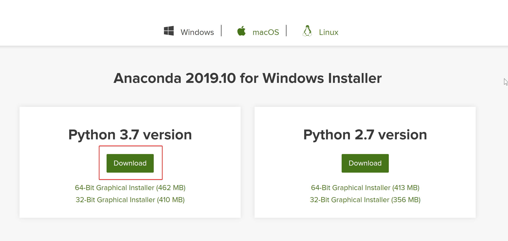

+ 下载完成后，运行可执行文件进行安装：

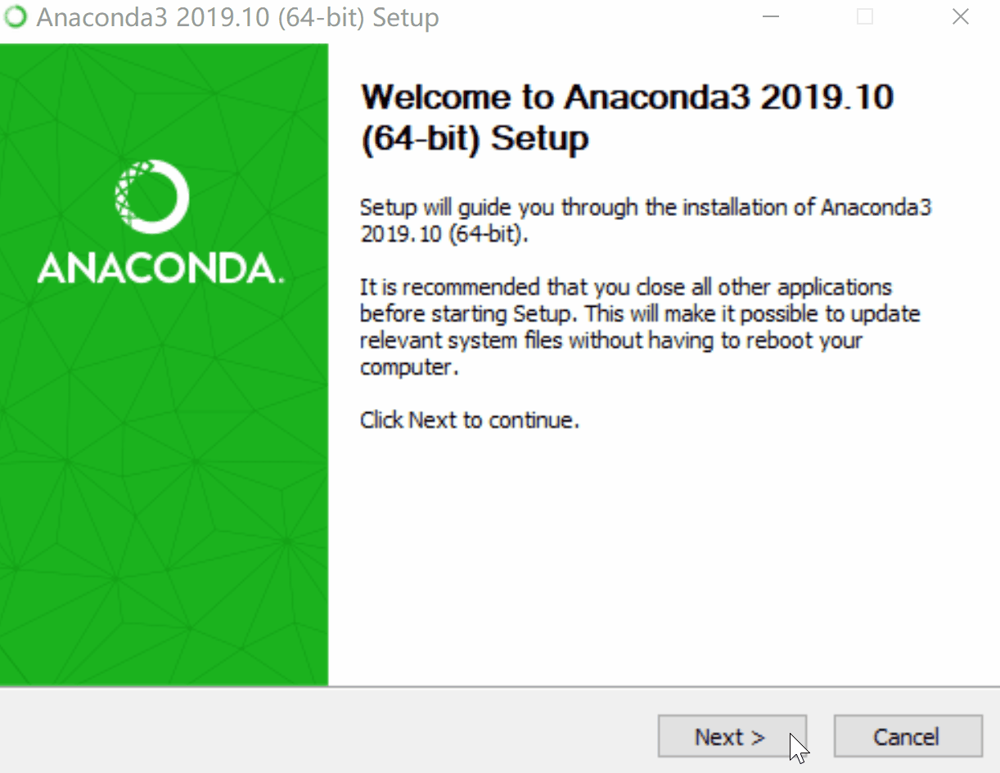

> **注意事项：**
>
> 1. Anaconda 需要占用较大的存储空间，可考虑安装在非系统盘。
> 2. 请在 “Advanced Options” 中将勾选两个可选选项：
>
> 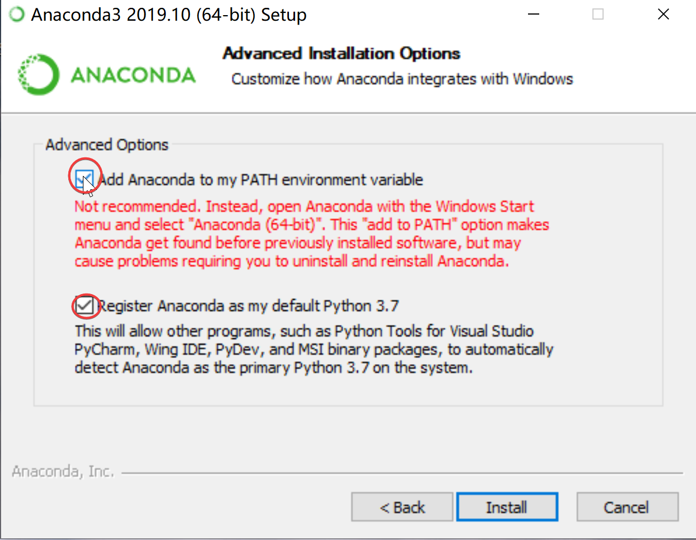
>
> + **第一个选项** 会将 Anaconda 的安装目录添加至系统环境变量的 path 中，此举有利于我们之后在 VS Code 中快速激活 conda 环境，以及直接使用 base 环境中的库，简化操作流程。
>
>   + 如上图红字所示，Anaconda 官方不建议勾选此选项，而建议使用 Anaconda Navigator 或 Anaconda Prompt 使用 Anaconda。这是因为勾选此选项会将 Anaconda 的若干目录添加至 path 目录中的最前面；如果用户之前已经安装了其他 Python 解释器，勾选此选项会导致用户直接调用 Python 时优先调用 Anaconda 内置的 Python，而不是用户单独安装的 Python。
>
>     
>
>   + 假如同学们希望系统默认调用先前安装过 Python 环境，一个较好的解决方法是在勾选此选项并完成安装 Anaconda 后，手动将原 path 中 Python 路径移动到 Anaconda 系列目录的前面。
>
>     
>
>   + 此时，在命令行调用 Python 时会优先调用单独安装的 Python解释器，只有在激活 conda 环境后才会调用 conda 里的 Python 解释器。（可以看到两个 Python 解释器的版本和版权说明有所区别。）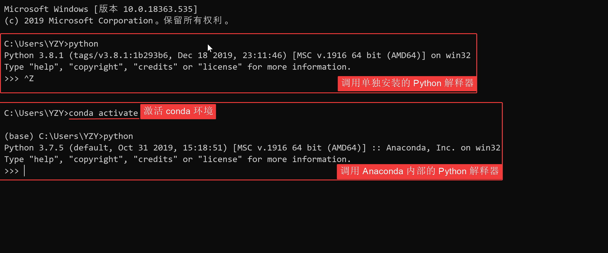
>
> + **第二个选项** 可使其他 Python 开发工具（如 VS Code）自动探测到 Anaconda。

+ 安装完成后，我们可以检查一下 Sphinx 是否正确，并更新一下 Anaconda 包含的各种包：

> **提示：**Anaconda 通常数月才更新一次，但其内部包含的包通常具有更快的更新频次，可使用 Anaconda 的包管理器对包进行单独更新。

​	打开 ”开始“菜单 - “Anaconda3” -  “Anaconda Powershell Prompt”，输入`conda list`后回车：

​	此指令会列出当前 Anaconda 内已安装的所有包，我们很容易可以看到 Sphinx 的存在：

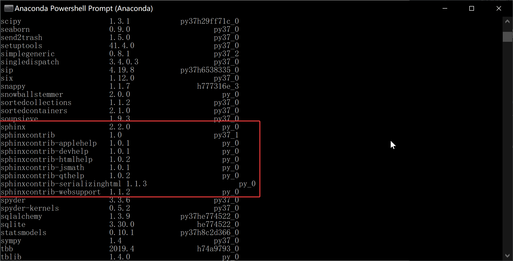

如图所示，目前 Anaconda 里的 Sphinx 的版本是 2.2.0，低于官网的最新版本。

我们可以在命令行中输入`conda update sphinx`单独对 Sphinx 进行更新，但考虑到我们是第一次使用 Anaconda，更加推荐的方式是使用`conda update --all`命令对 Anaconda 内所有的包都进行一次更新：

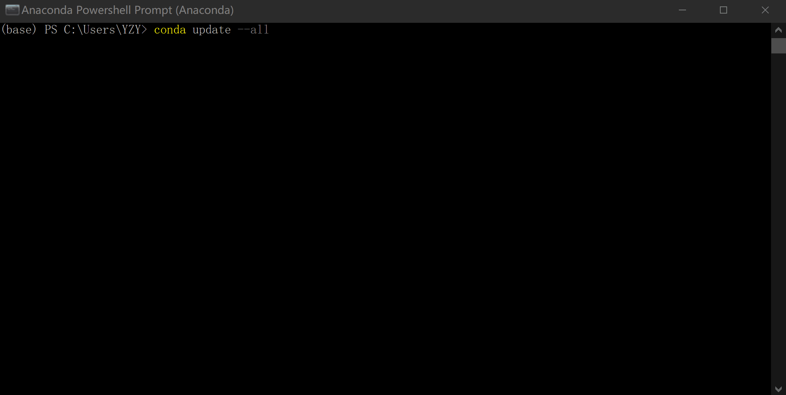

**注意：**中途需要手动输入一次`y`以进行确认，整个更新过程需要较长的一段时间，当命令行最后一行显示`done`时，更新完毕，现可关闭命令行窗口。

#### Visual Studio Code 安装与配置

+ 打开 [Visual Studio Code 官网](https://code.visualstudio.com/)，下载适合的安装包：

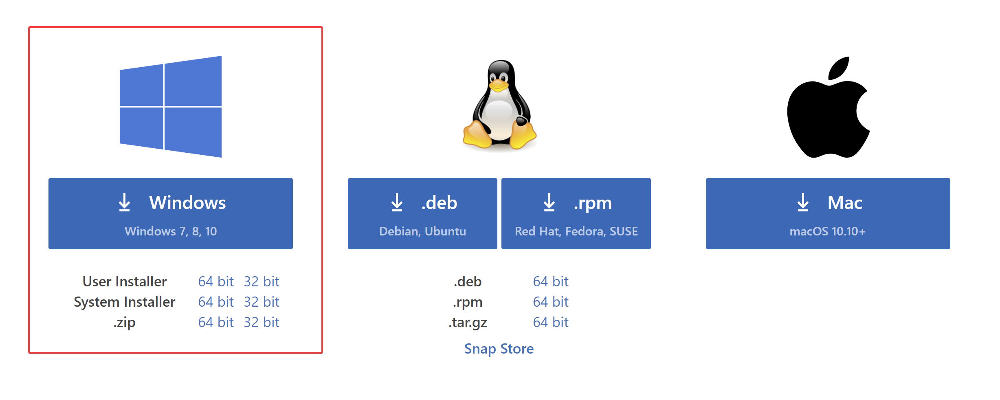

+ 下载完成后，运行可执行文件进行安装，其安装过程与 Anaconda 安装过程相似：
	+ **注意：** 请在“选择其他任务”中将所有复选框勾选上
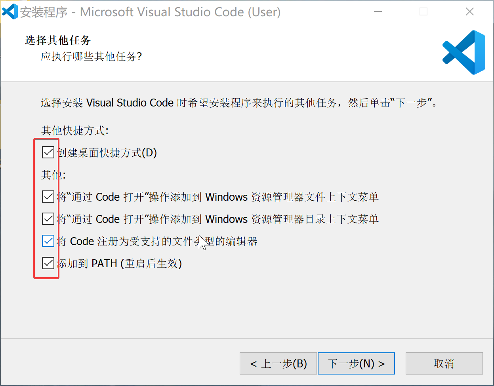

+ 完成安装后打开 VS Code，在 “Extentions” 中安装 “Python” 和 “reStructuredText” 拓展

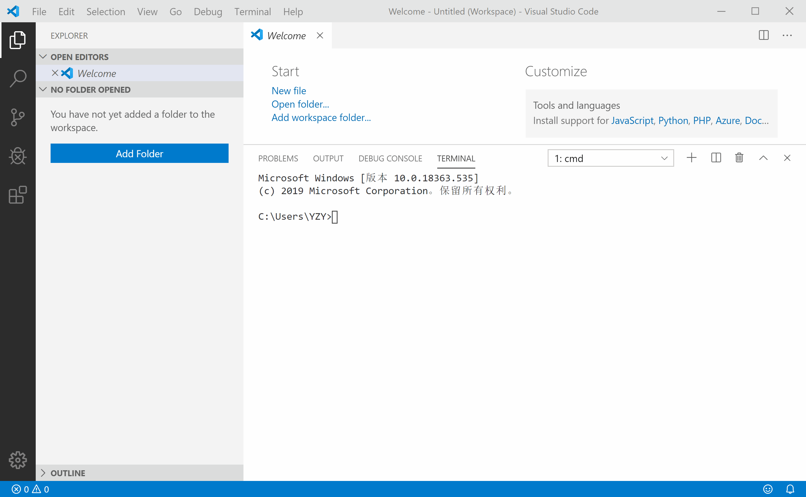

#### VS Code 调用 Sphinx (Anaconda)

由于我们之前在安装 Anaconda 的时候直接将 Anaconda 的目录添加到了系统环境变量的 path 中，我们可以直接在 VS Code 的终端使用 `sphinx-quickstart`命令创建一个 Sphinx 项目：

+ 在计算机任意位置新建一个文件夹，命名为`learn-sphinx`，右击文件夹单击“通过 Code 打开”

  

  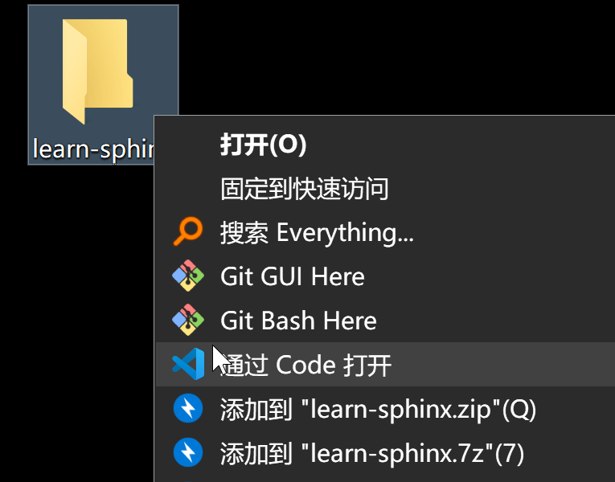

+ 在打开的 VS Code 窗口下的 Terminal 终端（可使用 <kbd>Ctrl</kbd> + <kbd>\`</kbd>  快捷键唤出）中输入 `sphinx-quickstart`，回车：

  
  
  当 VS Code 出现以上内容时，说明 Sphinx 开发环境已正确部署至你的计算机中，下一小节将会介绍如何创建你的第一个 Sphinx 项目。
  
  

# ------------ 【以下部分暂未完成】------------

---

### 1.2 macOS 环境配置  **（暂缺 | 王晴）**

---

## 2 第一个 Sphinx 项目

## 3 reStructuredText 语法指南

# （二）专题学习

-------

## 1 Sphinx 本地与云端发布（Read the Docs）

## 2 Sphinx 多人协作开发（GitHub）

## 3 Sphinx 主题模板定制（Jinjia）

# （三）拓展内容

## 1 Sphinx 与 Markdown

## 2 GitHub Pages 与 Jekyll

